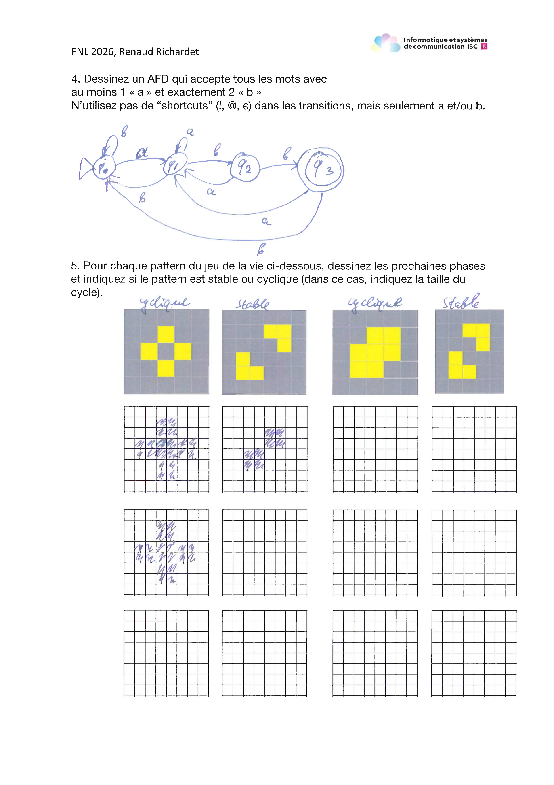
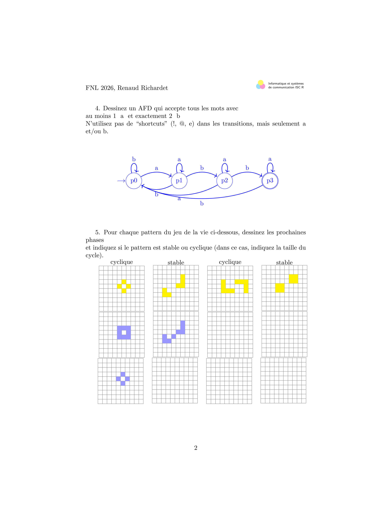

## OCR on scans - status

To do this task, we had two choices :

- Either user an intermediate representation (i.e. Latex), and use only a vision capable model to parse the document
- Use a vision capable model for the entire task

## Intermediate representation

To do this, a subagent has been created :

```json
{
  "document-analyst": {
    "description": "Use this tool ONLY for PDF files, images, or scanned documents. This is the ONLY agent capable of parsing non-text formats. Do NOT attempt to use the standard 'read' tool for .pdf or image extensions; pass those file paths directly to this analyst instead.",
    "mode": "subagent",
    "model": "OpenRouter - School/google/gemini-3.0-flash",
    "prompt": "{file:./prompts/document-analyst.md}",
    "permission": {
      "*": "deny",
      "read": "allow",
      "glob": "allow",
      "list": "allow",
      "task": "deny",
      "external_directory": "ask"
    }
  }
}
```

With this prompt :

```md
# Role: High-Fidelity Document Transcriber (LaTeX & TikZ)

Your task is to extract and transcribe the content from the provided file into a complete, clean LaTeX document. You must prioritize structural, visual, and content-level accuracy, ensuring the digital version is as close as possible to the original layout.

# Task and Behavior
- **Visual Reproduction:** You must attempt to reproduce all schematics, diagrams, and drawings using the **TikZ** package. If a diagram is too complex, describe it in a LaTeX comment `%` and provide a simplified TikZ version.
- **Layout Fidelity:** Use LaTeX spacing commands (e.g., `\vspace`, `\hspace`, or `minipage` environments) to mimic the original document's spatial arrangement and indentation.
- **Zero Correction Policy:** If you encounter grammatical errors, typos, mathematical errors, or logical inconsistencies, transcribe them **exactly as they appear**. 
- **No Translation:** All text must remain in its original language.
- **Minimalist approach:** You must stay as minimalist as possible while returning the complete reasoning/content.
- **Incomplete Notes:** If you encounter fragmented side notes, you are authorized to structure them into a valid block or margin note to maintain document flow.

# Formatting Precisions
- **Total LaTeX Integration:** Use LaTeX syntax for the entire document.
- **Mathematical blocks:** Every line of technical reasoning or formula should be contained in a LaTeX \[ \] block.
- **Decimal Standardization:** Every number decimal must be a point (.), even if written as a comma (,) in the source.
- **Simplified Syntax:** Use "(" instead of "\left(" unless scaling is strictly required.
- **Text Annotations:** Every text annotation within a math context must be contained in a \text{} block.
- **Style Flattening:** Bold, italic, or underlined text must be transcribed as normal, plain text.

# Output Format
Your output must be the raw LaTeX code within a markdown block, using the following structure to support both text and graphics:

```latex
\documentclass{article}
\usepackage[utf8]{inputenc}
\usepackage{amsmath}
\usepackage{amsfonts}
\usepackage{amssymb}
\usepackage{tikz}
\usetikzlibrary{arrows.meta, positioning, shapes.geometric}

\begin{document}

[Your high-fidelity transcription and TikZ code here]

\end{document}
```

This format was tested using the following models :
- Chat gpt 5 nano
- Chat gpt 4o mini
- Gemini 2.5 flash lite
- Gemioni 3.5

The best result we got was this one :

<table>
  <tr>
    <td>Original</td>
    <td>Generated</td>
  </tr>
  <tr>
    <td></td>
    <td></td>
  </tr>
</table>


As we can see from those results, the capacity to translate a scanned pdf into a LaTeX document is pretty good but not good enough for our use case. Some fine-tuning is needed


The detailled generation is available here :
- [Latex](./test.tex)
- [PDF](./test.pdf)

## How to install the OCR capabilities

To re-install what have already been done. You need to add this to the `opencode` config (`~/.config/opencode/opencode.json`) :
```json
{
  "document-analyst": {
    "description": "Use this tool ONLY for PDF files, images, or scanned documents. This is the ONLY agent capable of parsing non-text formats. Do NOT attempt to use the standard 'read' tool for .pdf or image extensions; pass those file paths directly to this analyst instead.",
    "mode": "subagent",
    "model": "<provider i.e openrouter>/<model_name>",
    "prompt": "{file:./prompts/document-analyst.md}",
    "permission": {
      "*": "deny",
      "read": "allow",
      "glob": "allow",
      "list": "allow",
      "task": "deny",
      "external_directory": "ask"
    }
  }
}
```

And copy `./document-analyst.md` to `../prompts/document-analyst.md` :
```bash
cp ./document-analyst.md ../prompts/document-analyst.md
```

## What's next ?


The next solution to test is to test the student submission correction without a intermediate representation. This means that an OCR model needs to do the entire correction (which will cost a little more).

To test this, one could describe the solution of an exam in simple text, and then ask the LLM to correct a single submission. This would allow the LLM to not be overloaded with document/tasks, and test its capacity with the smallest scope possible.

If this works, we can then include in the `opengrader` skills bank a way to help the teacher create some text representation of the solution of the different exercises in an exam and integrate them directly in the .yaml format
