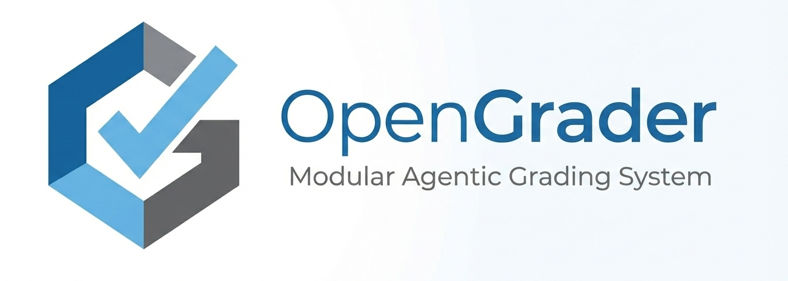

# OpenGrader



## About

OpenGrader is a modular agentic system to grade exams. It offers several tools:

- Extract the questions from various formats (LaTeX, Markdown, PDF, Excel, Word, JSON, etc.)
- Extract the questions and answers from various systems (Moodle, VPL).
- Extract answers from scanned exams.
- Assist in building the rubrics
- Pre-grade the exams using the rubrics and the answers.

Instead of offering a single, monolithic solution, OpenGrader is designed to be modular and extensible. 

OpenGrader capabilities are achieved through a set of skills, which are small, focused modules that can be combined to create a powerful system. Skills adheres to the `SKILL.md` [specification](https://agentskills.io/specification).

## Skills

OpenGrader comes with a set of skills that are bundled with the system. These skills are:

- `pdf`: Extract the questions from PDF files.
- `moodle`: Extract the questions and answers from Moodle.
- `vpl`: Extract the questions and answers from VPL.
- `scans`: Extract answers from scanned exams (OCR).
- `rubrics`: Assist in building the rubrics.

## Using OpenGrader

```bash
# Install dependencies (you'll need to do this)
pip install -r requirements.txt

# Set API key
export GOOGLE_API_KEY="your-key"

# Run interactively
1. Install the dependencies (one time only)

Install uv (https://docs.astral.sh/uv/getting-started/installation/)

```bash
cd src
uv sync
```

2. Add your exame files

Create a folder in the `my_exams` folder with the name of the exam.

3. Run the grader agent and follow the instructions

```bash
cd src
uv run grader_agent.py  {name of your exam folder, e.g. my_exam/test_sql}
```


## Credits

OpenGrader is built at [ISC](https://isc.hevs.ch) and released under the [Apache 2.0 License](LICENSE.txt).