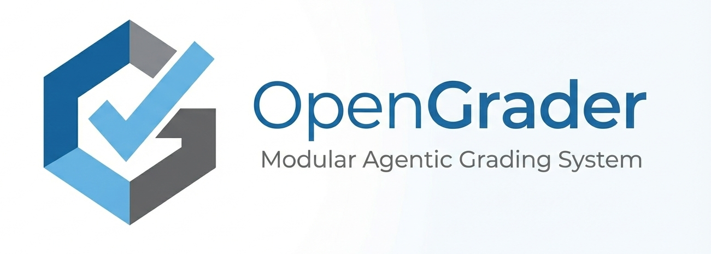

# OpenGrader



## About

OpenGrader is a modular agentic system to grade exams. It offers several tools:

- Extract the questions from various formats (LaTeX, Markdown, PDF, JSON, CSV etc.)
- Extract the questions and answers from various systems (Moodle, VPL, HybridProctor).
- Extract answers from scanned exams.
- Assist in building the rubrics
- Ability to run unit tests - test cases
- Pre-grade the exams using the rubrics and the answers.

Instead of offering a single, monolithic solution, OpenGrader is designed to be modular and extensible. 

OpenGrader capabilities are achieved through a set of skills, which are small, focused modules that can be combined to create a powerful system. Skills adheres to the `SKILL.md` [specification](https://agentskills.io/specification).

## Skills

OpenGrader comes with a set of skills that are bundled with the system. These skills are:

- `pdf`: Extract the questions from PDF files.
- `moodle`: Extract the questions and answers from Moodle.
- `scans`: Extract answers from scanned exams (OCR).
- `rubrics`: Assist in building the rubrics.

## Installation

As this project uses skills, you can just run the script `./install.sh` (which just create some symlink using `GNU stow`). This script will ask you which local agent you are using, if your local agent is not in this list, you need to find the right folder in which the skills needs to be created (you can find this in the doc of your local agent), and then choose the `Custom` option, and enter the folder path.

## Usage

For this project, we recommand using [OpenCode](https://opencode.ai/), as it can be linked to the AI agent of your choice, and support the `SKILL.md` [specification](https://agentskills.io/specification). But you can bring the local agent of your choice.

Using `opencode`, you can start a sessions either in the terminal (with a TUI) using :
```bash
opencode
```

Or start a web based session using :

```bash
opencode web
```

Then, you can start prompting the agent with requests like :
- `I want to import an exam I downloaded from Moodle` -> To trigger the `moodle-to-yaml` skill
- `I want to import some students submissions into my exam` -> To trigger the `import-student-answers` skill
- ...

Or you can force the usage of a particual skill by typing `/skills` and then pressing `Tab`.

## Local agents

Here are some local agents that have been tested to work with skills (in no particular order) :
- [OpenCode](https://opencode.ai/) (Recommanded)
- [Gemini CLI](https://geminicli.com/)
- [Claude Desktop](https://claude.com/download)

## Credits

OpenGrader is built at [ISC](https://isc.hevs.ch) and released under the [Apache 2.0 License](LICENSE.txt).
