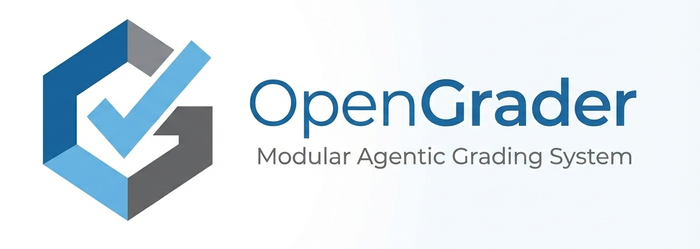

<picture>
  <source media="(prefers-color-scheme: dark)" srcset="https://raw.githubusercontent.com/ISC-HEI/isc-logos/main/white/ISC%20Logo%20inline%20white%20v3%20-%20large.webp">
  
</picture>

# OpenGrader



## About

OpenGrader is a modular agentic system to grade exams. It offers several tools:

- Extract the questions from various formats (LaTeX, Markdown, PDF, JSON, CSV etc.)
- Extract the questions and answers from various systems (Moodle, VPL, HybridProctor).
- Extract answers from scanned exams.
- Assist in building the rubrics
- Ability to run unit tests - test cases
- Pre-grade the exams using the rubrics and the answers.
- Export to PDFs formatted for Gradescope import.

Instead of offering a single, monolithic solution, OpenGrader is designed to be modular and extensible. 

OpenGrader capabilities are achieved through a set of skills, which are small, focused modules that can be combined to create a powerful system. Skills adheres to the `SKILL.md` [specification](https://agentskills.io/specification).

## Skills

OpenGrader comes with a set of skills that are bundled with the system. These skills are:

- **exam-markdown-to-yaml**: Transforms an exam markdown file into a structured YAML file, extracting metadata, questions, point values, types, and solutions.
- **export-exam-to-pdf**: Exports an exam YAML into PDFs ready for GradeScope upload, generating both blank templates and student answer PDFs with normalized page counts.
- **import-gradescope-rubrics**: Imports rubrics for exam correction from a GradeScope export.
- **import-student-answers**: Imports student submission files into an existing exam YAML file, automatically detecting folder structures and handling duplicates.
- **import-unit-tests**: Imports unit test code from files into an exam YAML file, matching tests to questions based on filenames or content.
- **moodle-html-to-yaml**: Extracts an HTML exam exported from Moodle into a YAML unified file format.
- **moodle-mbz-to-yaml**: Extracts and transforms a Moodle .mbz backup file into YAML format.
- **pregrade-submissions**: **BETA** Assists teachers in pre-grading student submissions against an official solution key.
- **rubric-activation-benchmark**: Assesses rubric activation based on pregrade feedback to benchmark LLM grading precision.
- **scan-to-yaml**: Extracts student answers from scanned paper exam PDFs into a unified YAML file using Gemini vision.
- **skill-creator**: Creates new skills, modifies and improves existing skills, and measures skill performance.
- **text-exam-to-yaml**: Parses any text-based exam file (txt, html, doc, rtf) into a structured YAML file.

## Scala-exam -> Typst PDF Grading Pipeline

For Scala lab-test exams with ScalaTest unit tests, a lighter direct-script pipeline is available alongside the full agentic workflow, without requiring OpenCode.

```
exam structure YAML + student submissions YAML
        │
        ├─ scripts/run_tests.py          → test_results.json
        ├─ scripts/generate_pdfs_typst.py → pdf/  (Gradescope-ready)
        └─ scripts/generate_summary.py   → summary.md + summary.pdf
```

See **[docs/WORKFLOW.md](docs/WORKFLOW.md)** for the full step-by-step guide (prerequisites, exam setup, ScalaTest integration, troubleshooting).

Sanitized exam templates (questions only, no student data) are stored in `exams/`.

## Installation

For this project, we recommend using [OpenCode](https://opencode.ai/), as it can be linked to the AI agent of your choice, and support the `SKILL.md` [specification](https://agentskills.io/specification). But you can bring the local agent of your choice. We will only detail installation and usage with this tool, and we officially support only this one. Tests have been made with `Claude Code` and it works as well.

Run the installation script to set up OpenGrader with OpenCode:

```bash
uv run install.py
```

This script installs three components to `~/.config/opencode/`:
- **Skills**: Linked from the `skills/` folder using GNU stow
- **Prompts**: Linked from the `prompts/` folder using GNU stow  
- **Config**: Merged with your existing OpenCode config (if any), overlaying only the options defined in `config/opencode.json`

## Usage

Using `opencode`, you can start a sessions either in the terminal (with a TUI) using :
```bash
opencode
```

Or start a web based session using :

```bash
opencode web
```

Then, to cycle between the different agent (and use the `OpenGrader` agent), you can use the `tab` key by default.

Then, you can start prompting the agent with requests like :
- `I have a Moodle .mbz backup file I want to convert to YAML` -> To trigger the `moodle-mbz-to-yaml` skill
- `I have a Moodle HTML export I want to convert to YAML` -> To trigger the `moodle-html-to-yaml` skill
- `I want to import some students submissions into my exam` -> To trigger the `import-student-answers` skill
- `I want to export my exam to PDFs for GradeScope` -> To trigger the `export-exam-to-pdf` skill
- `I have scanned paper exams I want to extract answers from` -> To trigger the `scan-to-yaml` skill
- `I want to create a new skill for this project` -> To trigger the `skill-creator` skill

Or you can force the usage of a particual skill by typing `/skills` and then pressing `Tab`.

## Model Selection

OpenGrader will work with any model supported by your provider. For small workloads, such as imports, exports, and format conversions **Qwen3.5-122B-A10B** is a very good fit. For grading tasks like **pregrade-submissions** and **rubric-activation-benchmark**, a larger model with stronger reasoning capabilities, such as **Qwen3.5-397B-A17B**, is a better choice. Any capable model (Gemini, Claude, etc.) will work well too.

### Changing the Model

Use the `/connect` command to connect to your preferred provider (OpenRouter, Anthropic, Google, etc.). Then use `/model` to select the specific model.

When selecting a model, you will often see multiple entries for the same model name, one per provider offering it. Make sure to pick the correct model entry for the provider you connected with.

For full details, see the [OpenCode documentation on model configuration](https://opencode.ai/docs/models/).

## Development and Observability

To enable LLM debugging, you have two paths forward :
- OpenRouter Broadcasting
- Local LiteLLM proxy

### OpenRouter Broadcasting

This solution is the simplest to implement, but it will limit the model you debug to only the ones available on `OpenRouter`. 

To enable the broadcasting, got to [this](https://openrouter.ai/settings/observability) page, and toggle the Observability broadcast switch. Then, connect for example a `Langfuse` instance to this by adding your private and public key.

### Local LiteLLM proxy

This solution deploy a local instance of `Langfuse`, and a small LLM proxy named `LiteLLM` to forward all the requests. This allows to log all the requests made from OpenCode (independently from the model/provider selected) to the local instance of langfuse.

You can follow the instructions [here](./local_proxy/README.md) to install and use it.

## Credits

OpenGrader is built at [ISC](https://isc.hevs.ch) and released under the [Apache 2.0 License](LICENSE.txt).
